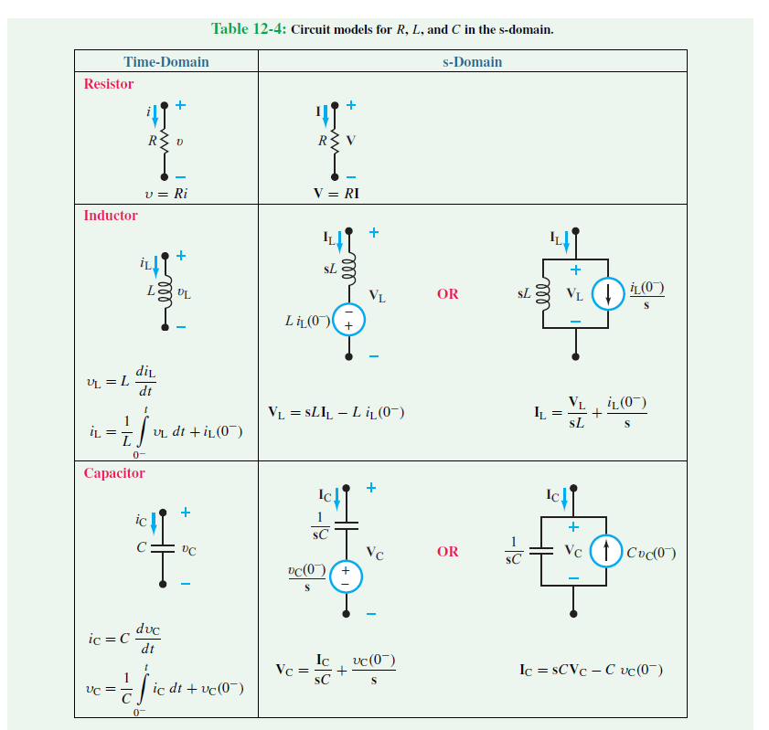

# Analyze a Circuit With Initial Conditions Using Laplace Transform

## Prerequisite Knowledge
Before continuing, you must have covered:  
* Voltage-current relationships for ideal resistors, capacitors, and inductors  
* Methods of circuit analysis  
* Laplace transformation  
* Inverse Laplace transformation  

## General steps in applying the Laplace transform:
1. Transform the circuit from time domain to the s-domain.
2. Use methods of circuit analysis such as nodal, mesh, source transformation, superposition, and other techniques that you are familiar with.
3. Transform the solution back to time domain using inverse transform.

## Laplace Transformation of Ideal Resistors, Capacitors, and Inductors

### Resistors
The Laplace transformation of a resistor's impedence with a value of $$R\, \Omega$$ is $$R\, \Omega$$. 
   
The voltage-current relationship for a resistor in the time domain is  

 $$V(t) = Ri(t)$$  
  
By taking the Laplace transform, it is transformed into the s-domain

 $$V(s) = RI(s)$$ 
  

### Inductors
Unlike resistors which dissipate energy and thus are independent of frequency (also expressed through Ohm's Law), inductors store energy when current flows through them, and thus are frequency-dependent. 
   
This can also be expressed through the equation

 $$V(t) = L\frac{di(t)}{dt}$$ 
  
By taking the Laplace transform, it is transformed into the s-domain

 $$V(s) = L[sI(s)-i(0^-)] = sLI(s) - Li(0^{-}) $$  
$$V(s) - sLI(s) + Li(0^{-}) = 0$$ 
  
Notice that on the table of circuits above for s-domain, $$sLI(s)$$ represents the voltage drop across the inductor, and $$-Li(0^{-})$$ represents the inductor's initial voltage drop when $$t=0$$ in the form of a voltage source. Due the term being negative, the polarity of the voltage source is opposite to the inductor with the source's positive plate facing away from it. The second equation might provide a better perspective of how each component contributes to the total voltage.
  
The voltage source can be turned into a current source using **source transformation** with the current source parallel to the inductor. This can also be shown by isolating $$I(s)$$ from the previous equations  

 $$I(s) = \frac{V(s)}{sL} + \frac{i(0^-)}{s} $$  
$$I(s) - \frac{V(s)}{sL} - \frac{i(0^-)}{s} = 0$$ 
  
Going back to the table, $$\frac{V(s)}{sL}$$ represents the current going across the inductor, and $$\frac{i(0^-)}{s}$$ represents the current that was initially going across the inductor when $$t=0$$. The second equation might provide a better perspective of how the current is split between branches.  

### Capacitors

$$
\mathscr{L}\{f(t)\}=\int_{t=0}^{\infty}f(t)e^{-st}dt
$$